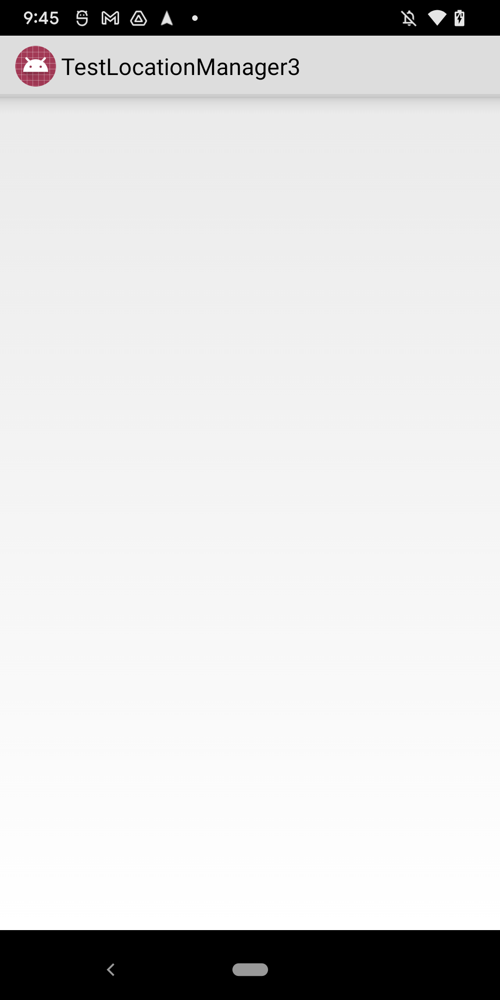
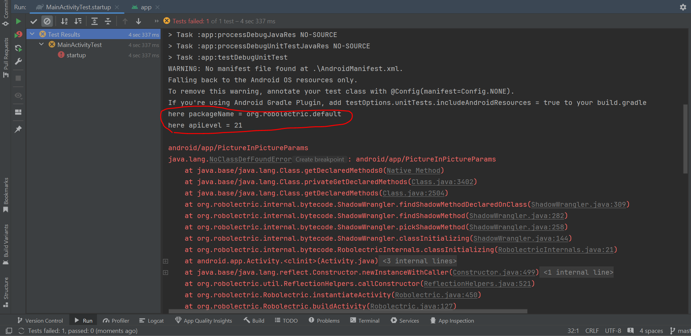
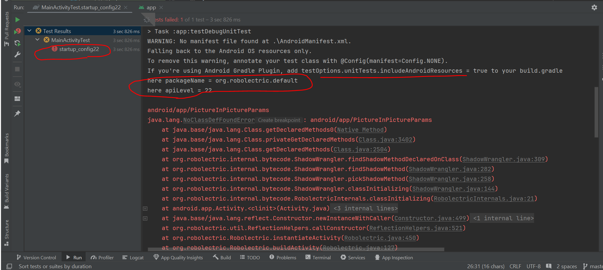
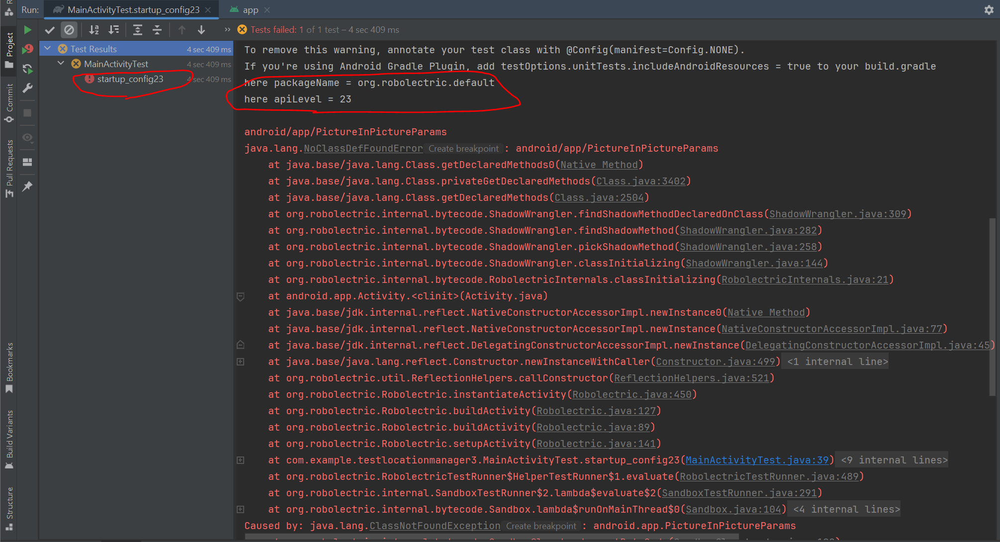
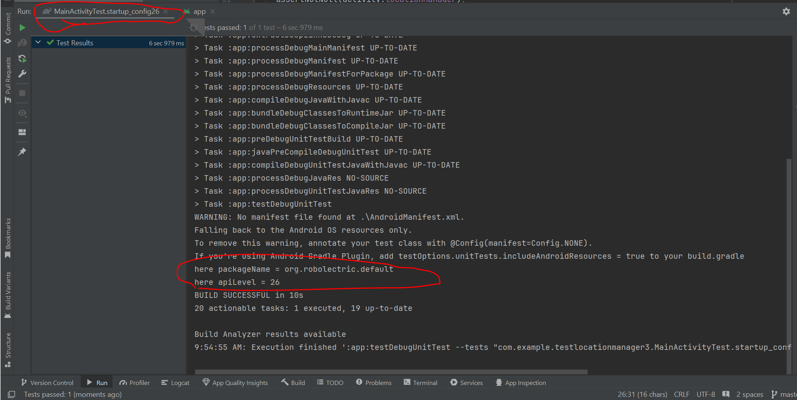

# Play with how Robolectric works concerned with shadows has type from higher API running in lower sdk

## Setup

I intentionally used super low compileSdk, targetSdk

```
android {
  namespace = "com.example.testlocationmanager3"
  compileSdk = 22                 # intentional super low compile sdk

  defaultConfig {
    applicationId = "com.example.testlocationmanager3"
    minSdk = 21 
    targetSdk = 22                # intentional super low target sdk
    versionCode = 1
    versionName = "1.0"
  }
  ...
}
```

## MainActivity

```java
public class MainActivity extends android.app.Activity {

  LocationManager locationManager;

  @Override
  protected void onCreate(Bundle savedInstanceState) {
    super.onCreate(savedInstanceState);
    locationManager = (LocationManager) getSystemService(Context.LOCATION_SERVICE);
  }
}
```

## MainActivityTest

```java

@RunWith(RobolectricTestRunner.class)
public class MainActivityTest {

  @Test
  public void startup() {
    System.out.println("here packageName = " + RuntimeEnvironment.application.getPackageName());
    System.out.println("here apiLevel = " + RuntimeEnvironment.getApiLevel()); // output is "21"
    MainActivity activity = Robolectric.setupActivity(MainActivity.class);

    assertNotNull(activity.locationManager);
  }

  @Config(sdk = {22})
  @Test
  public void startup_config22() {
    System.out.println("here packageName = " + RuntimeEnvironment.application.getPackageName());
    System.out.println("here apiLevel = " + RuntimeEnvironment.getApiLevel()); // output is "22"
    MainActivity activity = Robolectric.setupActivity(MainActivity.class);

    assertNotNull(activity.locationManager);
  }

  @Config(sdk = {23})
  @Test
  public void startup_config23() {
    System.out.println("here packageName = " + RuntimeEnvironment.application.getPackageName());
    System.out.println("here apiLevel = " + RuntimeEnvironment.getApiLevel());  // output is "23"
    MainActivity activity = Robolectric.setupActivity(MainActivity.class);

    assertNotNull(activity.locationManager);
  }

  @Config(sdk = {26})
  @Test
  public void startup_config26() {
    System.out.println("here packageName = " + RuntimeEnvironment.application.getPackageName());
    System.out.println("here apiLevel = " + RuntimeEnvironment.getApiLevel());  // output is "26"
    MainActivity activity = Robolectric.setupActivity(MainActivity.class);

    assertNotNull(activity.locationManager);
  }
}
```

## Run

In order to make the app build successfully, I removed dependencies on **androidx.XXXXX** (because
androidx requires higher compileSdk), and the
app successfully ran on my Pixel Android 12, API 31.

<figure>
    
    <figcaption>Running on Android 12, API 31</figcaption>
</figure>

## MainActivityTest

I wrote several test functions here.

### MainActivityTest#startup

<figure>
    
</figure>

### MainActivityTest#startup_config22

<figure>
    
</figure>

### MainActivityTest#startup_config23

<figure>
    
</figure>

### MainActivityTest#startup_config26

<figure>
    
</figure>

## Why PictureInPictureParams error in API < 26?

Because **PictureInPictureParams** is added
in [API 26](https://github.com/AndroidSDKSources/android-sdk-sources-for-api-level-26/blob/master/android/app/PictureInPictureParams.java),
and **ShadowActivity** referenced **PictureInPictureParams** [link](https://github.com/robolectric/robolectric/blob/master/shadows/framework/src/main/java/org/robolectric/shadows/ShadowActivity.java#L901-L902)


However, if I change compileSdk to 34, then all test functions in **MainActivityTest** will succeed when run **one by one**

```
android {
  namespace = "com.example.testlocationmanager3"
  compileSdk = 34                 # high API

  defaultConfig {
    applicationId = "com.example.testlocationmanager3"
    minSdk = 21 
    targetSdk = 22                # intentional super low target sdk
    versionCode = 1
    versionName = "1.0"
  }
  ...
}
```

Change targetSdk to high API test(s) will still fail

```
android {
  namespace = "com.example.testlocationmanager3"
  compileSdk = 22                 # intentional super low target sdk

  defaultConfig {
    applicationId = "com.example.testlocationmanager3"
    minSdk = 21 
    targetSdk = 34                # high API
    versionCode = 1
    versionName = "1.0"
  }
  ...
}
```